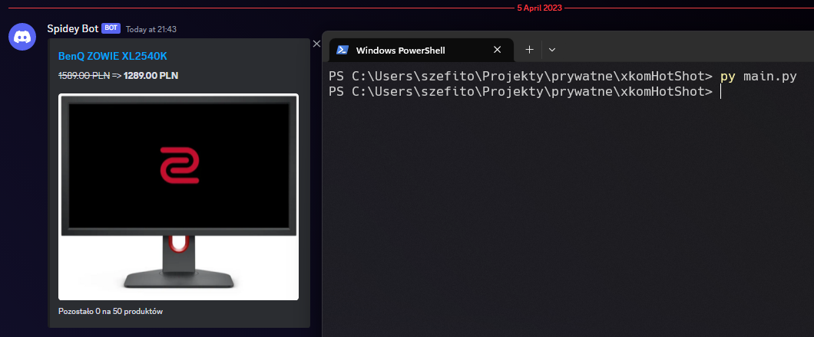

# xkom-hotshot 🇵🇱

Skrypt napisany w Pythonie, nie wymagający żadnych zależności, wysyłający na Discorda najnowszy gorący strzał z [x-komu](https://www.x-kom.pl/)

## Działanie



## Instalacja

Sklonuj to repo

```
git clone https://github.com/sevnnn/xkom-hotshot.git && cd xkom-hotshot
```

Utwórz i dostosuj swój plik `config.ini`

```
mv ./config.ini.dist ./config.ini
```

Następnie możesz uruchomić skrypt wpisując
```
py main.py
```

## crontab

Ten skrypt został przygotowany pod ruszanie w [crontabie](https://pl.wikipedia.org/wiki/Crontab), tutaj konfiguracja której używam:
```
0 10,22 * * * python3 ~/github/xkom-hotshot/main.py
```
